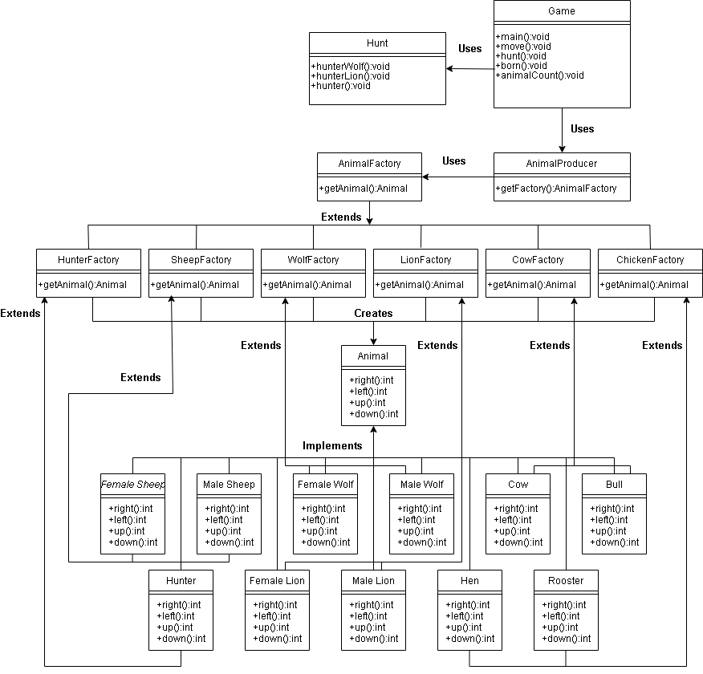

# Zoo

While developing this project, Abstract Factory Pattern was used to provide the best code optimization. Thanks to this pattern, an interface is designed to create related objects without specifying concrete classes. In addition to this pattern, it has been provided to inherit from factories that are necessary for the formation of classes. In this way, the process of creating a new animal from the same species was realized in more optimized way. Below is the UML diagram for classes.

The number of animals in the playground after 1000 units of action is shown below. Because of the large playground, the birth of new animals and hunting events are rare. In order to fully see these events, the playing field should be minimized.

